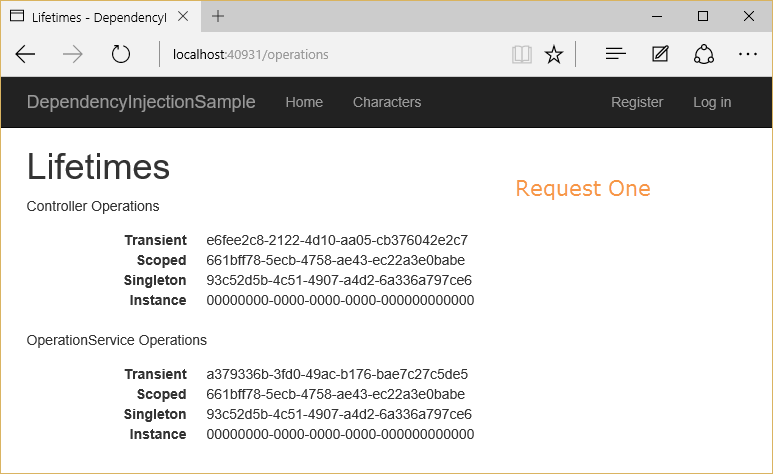

# web-recap

Revision of Distributed Applications Development
This readme contains all the steps for developing practic example of

-   JAVA REST
-   Node REST
-   JSP (HTML + Java Servlet)
-   SERVLET ( only Java )
-   JSP + SERVLET
-   ASP Theory

## JavaREST steps

### More information:

```
https://github.com/critoma/dad/tree/master/lectures/c08/rest/s08_jweb_jaxrs_server
```

1. Create a folder in src named `bean` ( `src/eu/ase/java/bean` )
2. Create model class/classes

-   -   2.1.`Product.java`
-   -   2.2.`Status.java`

3.  Create a folder in src name `rest` ( `src/eu/ase/java/rest` )
4.  Create REST Server

-   -   4.1.`MyRESTServices.java`
-   -   4.2.`ProductCatalogResource.java`

###1. Create a folder in src named `bean`

###2. Create model class/classes

#### 2.1.`Product.java`

```
package eu.ase.java.bean;

import java.io.Serializable;
import javax.xml.bind.annotation.XmlRootElement;
@XmlRootElement
public class Product implements Serializable {
    private static final long serialVersionUID = 6826191735682596960L;
    private int id;
    private String name;
    private String category;
    private double unitPrice;

    public Product() {} // needed for JAXB
    public Product(int id, String name, String category, double unitPrice) {
        this.id = id;
        this.name = name;
        this.category = category;
        this.unitPrice = unitPrice;
    }
    public int getId() {
        return id;
    }
    public void setId(int id) {
        this.id = id;
    }
    public String getName() {
        return name;
    }
    public void setName(String name) {
        this.name = name;
    }
    public String getCategory() {
        return category;
    }
    public void setCategory(String category) {
        this.category = category;
    }
    public double getUnitPrice() {
        return unitPrice;
    }
    public void setUnitPrice(double unitPrice) {
        this.unitPrice = unitPrice;
    }
}

```

#### 2.2.`Status.java`

```
package eu.ase.java.bean;

import java.io.Serializable;
import javax.xml.bind.annotation.XmlRootElement;
@XmlRootElement
public class Status implements Serializable {
    private static final long serialVersionUID = -9130603850117689481L;
    private String status;
    private String message;

    public Status() {} // needed for JAXB

    public Status(String status, String message) {
        this.status = status;
        this.message = message;
    }

    public String getStatus() {
        return status;
    }
    public void setStatus(String status) {
        this.status = status;
    }

    public String getMessage() {
        return message;
    }

    public void setMessage(String message) {
        this.message = message;
    }
}

```

### 3. Create a folder in src name `rest`

### 4. Create REST Server

#### 4.1.`MyRESTServices.java`

```
package eu.ase.java.rest;

import javax.ws.rs.ApplicationPath;
import org.glassfish.jersey.server.ResourceConfig;

// https://www.pegaxchange.com/2016/08/11/jax-rs-java-rest-service-eclipse-tomcat/
// http://127.0.0.1:8080/s08_jweb_jaxrs_server/restservices/productcatalog/search/category/electronics
// http://127.0.0.1:8080/s08_jweb_jaxrs_server/restservices/productcatalog/search/category/hardware
// http://127.0.0.1:8080/s08_jweb_jaxrs_server/restservices/productcatalog/search/category/books

// http://127.0.0.1:8080/s08_jweb_jaxrs_server/restservices/productcatalog/search?name=Hammer

// insert into Postman in Chrome using POST instead of GET:
// http://127.0.0.1:8080/s08_jweb_jaxrs_server/restservices/productcatalog/insert
/*
Content-Type: application/json

{
 "id":11,
 "name":"Drill",
 "category":"Hardware",
 "unitPrice":294.39
}
 */


@ApplicationPath("restservices")
public class MyRESTServices extends ResourceConfig {
    public MyRESTServices() {
        packages("com.fasterxml.jackson.jaxrs.json");
        packages("eu.ase.java.rest");
    }
}

```

#### 4.2.`ProductCatalogResource.java`

```
package eu.ase.java.rest;

import java.util.*;
import javax.ws.rs.Consumes;
import javax.ws.rs.GET;
import javax.ws.rs.POST;
import javax.ws.rs.Path;
import javax.ws.rs.PathParam;
import javax.ws.rs.Produces;
import javax.ws.rs.QueryParam;
import javax.ws.rs.core.MediaType;
import eu.ase.java.bean.Product;
import eu.ase.java.bean.Status;

@Path("productcatalog")
public class ProductCatalogResource {
    private static List<Product> productCatalog = null;
    public ProductCatalogResource() {
        initializeProductCatalog();
    }
    @GET
    @Path("search/category/{category}")
    @Produces(MediaType.APPLICATION_JSON)
    public Product[] searchByCategory(@PathParam("category") String category) {
        List<Product> products = new ArrayList<Product>();
        for (Product p : productCatalog) {
            if (category != null && category.equalsIgnoreCase(p.getCategory())) {
                products.add(p);
            }
        }
        return products.toArray(new Product[products.size()]);
        //return (Product[])products.toArray();
    }

    @GET
    @Path("search")
    @Produces(MediaType.APPLICATION_JSON)
    public Product[] searchByName(@QueryParam("name") String name) {
        List<Product> products = new ArrayList<Product>();
        for (Product p : productCatalog) {
        //for (Product p : (Product[])productCatalog.toArray()) {
            if (name != null && name.toLowerCase().startsWith(p.getName().toLowerCase())) {
                products.add(p);
            }
        }
        return products.toArray(new Product[products.size()]);
        //return (Product[])products.toArray();
    }

    @POST
    @Path("insert")
    @Consumes(MediaType.APPLICATION_JSON)
    @Produces(MediaType.APPLICATION_JSON)
    public Status insert(Product product) {
        productCatalog.add(product);
        return new Status("SUCCESS", "Inserted " + product.getName());
    }
    private void initializeProductCatalog() {
        if (productCatalog == null) {
            productCatalog = new ArrayList<Product>();
            productCatalog.add(new Product(1, "Keyboard", "Electronics", 29.99D));
            productCatalog.add(new Product(2, "Mouse", "Electronics", 9.95D));
            productCatalog.add(new Product(3, "17\" Monitor", "Electronics", 159.49D));
            productCatalog.add(new Product(4, "Hammer", "Hardware", 9.95D));
            productCatalog.add(new Product(5, "Screwdriver", "Hardware", 7.95D));
            productCatalog.add(new Product(6, "English Dictionary", "Books", 11.39D));
            productCatalog.add(new Product(7, "A House in Bali", "Books", 15.99D));
            productCatalog.add(new Product(8, "An Alaskan Odyssey", "Books", 799.99D));
            productCatalog.add(new Product(9, "LCD Projector", "Electronics", 1199.19D));
            productCatalog.add(new Product(10, "Smart Thermostat", "Electronics", 1199.19D));
        }
    }
}


```

---

## NodeREST steps

### More information:

```
https://github.com/critoma/dad/tree/master/lectures/c09/nodejs

```

### 1. Create the file

```
const express = require('express');
const fs = require('fs');
const app = express();
app.use(express.json());

app.get('/', (req, res) => {
	const data = JSON.parse(fs.readFileSync('./data.json'));
	res.status(200).send(data);
});

app.get('/:id', (req, res) => {
	const id = req.params.id;
	const userData = JSON.parse(fs.readFileSync('./data.json')).find((e) => e.id == id);
	res.status(200).send(userData);
});
app.listen(8080, () => {
	console.log('Server is listening on 127.0.0.1:8080....');
});

/**
 * 32. please write down using nodejs and express module
 * for handling a http post request in order to have an addition of two arrays from the json payload
 */
/**
 *
 * {
    "array1":[1,2,3,4,5,6,7,8],
    "array2":[1,2,3,4,5,6,9,8]
}
 */

app.post('/sum', (req, res) => {
	const payload = req.body;
	const minLength = Math.min(payload.array1.length, payload.array2.length);
	const result = new Array(minLength).fill(0);
	for (let i = 0; i < minLength; i++) {
		result[i] = payload.array1[i] + payload.array2[i];
	}
	res.status(201).send(result);
});

```

### `Post payload`

```
{
    "array1":[1,2,3,4,5,6,7,8],
    "array2":[1,2,3,4,5,6,9,8]
}
```

### `data.json`

```
[
	{
		"userId": 1,
		"id": 1,
		"title": "delectus aut autem",
		"completed": false
	},
	{
		"userId": 1,
		"id": 2,
		"title": "quis ut nam facilis et officia qui",
		"completed": false
	},
	{
		"userId": 1,
		"id": 3,
		"title": "fugiat veniam minus",
		"completed": false
	},
	{
		"userId": 1,
		"id": 4,
		"title": "et porro tempora",
		"completed": true
	},
	{
		"userId": 1,
		"id": 5,
		"title": "laboriosam mollitia et enim quasi adipisci quia provident illum",
		"completed": false
	},
	{
		"userId": 1,
		"id": 6,
		"title": "qui ullam ratione quibusdam voluptatem quia omnis",
		"completed": false
	},
	{
		"userId": 1,
		"id": 7,
		"title": "illo expedita consequatur quia in",
		"completed": false
	},
	{
		"userId": 1,
		"id": 8,
		"title": "quo adipisci enim quam ut ab",
		"completed": true
	},
	{
		"userId": 1,
		"id": 9,
		"title": "molestiae perspiciatis ipsa",
		"completed": false
	},
	{
		"userId": 1,
		"id": 10,
		"title": "illo est ratione doloremque quia maiores aut",
		"completed": true
	},
	{
		"userId": 1,
		"id": 11,
		"title": "vero rerum temporibus dolor",
		"completed": true
	}
]

```

---

## JSP (HTML + Java Servlet)

1. In Eclipse `Create new Dynamic Project`
2. Create in `src/main/java` a package `exercises`
3. Create in `src/webapp` `index.html`
4. Create a `Utils` class to generate HTML responses more easily
5. Add different exercises (e.g. `Exercise1.java` )

### Exercise 1 - Please give the source code statement for handling a HTTP POST request in a servlet with parameter p1 and extract the value of it and convert to the Integer if the case.

### `Utils.java`

```
package exercises;

import java.io.PrintWriter;

public class Utils {

	public static void generateHTML(PrintWriter out, String divId, String title, String parameter) {

		 out.write("<html><body><div id='"+ divId +"'>");
		 out.write("<h2>" + title +"</h2>");
		 out.write("<p>param1: " + parameter + "</p>");
		 out.write("</div></body></html>");


	}
}

```

### `Index.html`

```
<!DOCTYPE html>
<html>
<head>
<meta charset="ISO-8859-1">
<title>Web and Cloud security - Recap</title>
</head>
<body>


	<h3>Web and Cloud security - Recap</h3>

	<ul>
			<!-- http://localhost:8080/Web_Recap/Exercise1?p1=443 -->
		<li><a href="Exercise1" target="_blank">Exercise 1 (doPost)</a> </li>
	</ul>
</body>
</html>
```

### `Exercise1.java`

```
package exercises;

import java.io.IOException;
import java.io.PrintWriter;

import javax.servlet.ServletException;
import javax.servlet.annotation.WebServlet;
import javax.servlet.http.HttpServlet;
import javax.servlet.http.HttpServletRequest;
import javax.servlet.http.HttpServletResponse;

/**
 *

2.Please give the source code statement for handling a HTTP POST request in a servlet
with parameter p1 and extract the value of it and convert to the Integer if the case.
 */
@WebServlet("/Exercise1")
public class Exercise1 extends HttpServlet{

	/**
	 *
	 */
	private static final long serialVersionUID = 1L;

	public Exercise1() {
		super();

	}

	@Override
	protected void doPost(HttpServletRequest req, HttpServletResponse resp) throws ServletException, IOException {
		resp.setContentType("text/html");
		String p1 =req.getParameter("p1");
		if(p1==null || p1.length() == 0) {
			throw new ServletException();
		}else {
			Integer intP1= Integer.parseInt(p1);
			PrintWriter out = resp.getWriter();
			Utils.generateHTML(out, "divID1", "Response Exercise 1", intP1.toString());
			out.close();
		}
	}


}

```

### Exercise 2 - Please write down java ee/spring api the code the instantiate the bean when http request is handled.

### `indexWithBeans.jsp`

```
<%@page import="java.io.PrintWriter"%>
<%@ page language="java" contentType="text/html; charset=ISO-8859-1"
    pageEncoding="ISO-8859-1"%>

<!DOCTYPE html>
<html>
<head>
<meta charset="ISO-8859-1">
<title>Web and Cloud security - Recap</title>
</head>
<body  >


	<h3>Web and Cloud security - Recap</h3>

	<ul>
		<li>
			<jsp:useBean id="ex2" class="exercises.Exercise2" />
			<%
		 			ex2.setName("Exercise 2 MAMA LOR de HOTI");
				ex2.printExercise2(out, "divID2", "Response Exercise 2", ex2.getName());
			%>
		</li>

	</ul>
</body>
</html>
```

### `Exercise2.java`

```
package exercises;

import java.io.IOException;


import javax.servlet.jsp.JspWriter;

public class Exercise2 {
	private String name;
	private int age;

	public Exercise2(String name, int age) {
		super();
		this.name = name;
		this.age = age;
	}

	public Exercise2() {
		super();
	}

	public String getName() {
		return name;
	}
	public void setName(String name) {
		this.name = name;
	}
	public int getAge() {
		return age;
	}
	public void setAge(int age) {
		this.age = age;
	}
	public void printExercise2(JspWriter out, String divId, String title, String parameter) throws IOException {
		Utils.generateHTML(out, divId, title, parameter);
	}

}

```

### `Utils.java`

```
package exercises;

import java.io.IOException;
import java.io.PrintWriter;

import javax.servlet.jsp.JspWriter;

public class Utils {

	public static void generateHTML(PrintWriter out, String divId, String title, String parameter) {
		 out.write("<html><body><div id='"+ divId +"'>");
		 out.write("<h2>" + title +"</h2>");
		 out.write("<p>param1: " + parameter + "</p>");
		 out.write("</div></body></html>");


	}
	public static void generateHTML(JspWriter out, String divId, String title, String parameter) throws IOException {

		 out.print("<html><body><div id='"+ divId +"'>");
		 out.print("<h2>" + title +"</h2>");
		 out.print("<p>param1: " + parameter + "</p>");
		 out.print("</div></body></html>");


	}
}


```

---

## SERVLET ( only Java )

1. In Eclipse `Create new Dynamic Project`
2. Create in `src/main/java` a package `exercises`
3. Add different exercises (e.g. `Exercise2.java` )

### Exercise 3 - Write the code for jsp bean instantiation and specify the concurrency and security issues

```
<jsp:useBean id= "instanceName" scope= "page | request | session | application"
class= "packageName.className" type= "packageName.className"
beanName="packageName.className | <%= expression >" >
</jsp:useBean>
```

-   When a JSP is requested for the first time or when the web app starts up, the servlet container will compile it into a class extending HttpServlet and use it during the web app's lifetime (source).JSP have a Page Directive Attributes. You can check it in the specification. Specifically, there is a attribute that you can change on the page:

```
<%@ page isThreadSafe="false" %>
```

-   -   If `false` then the JSP container shall dispatch multiple outstanding client requests, one at a time, in the order they were received, to the page implementation for processing.
-   -   If `true` then the JSP container may choose to dispatch multiple outstanding client requests to the page simultaneously.

-   Page authors using `true` must ensure that they properly synchronize access to the shared state of the page. Default is `true`. Note that even if the `isThreadSafe` attribute is `false` the JSP page author must ensure that accesses to any shared objects are properly synchronized. The objects may be shared in either the `ServletContext` or the `HttpSession`.
-   So, if you set the `isThreadSafe` attribute to `false` (thus that the resulting servlet should implement the `SingleThreadModel`) and you make sure that your scriplet do not use objects that shared in either the `ServletContext` or the `HttpSession`, then it may be a good way to resolve the concurrency issues.

### Exercise 4 - Session hijacking - please provide a sample in node.js and other language-platform for this action

1. Suppose you are running this `ShowSession.java` that shows some cookies
2. You create session with nodejs and you highjack the initial session with the cookies

##### 1. Suppose you are running this `ShowSession.java` that shows some cookies

```
package eu.ase.httpservlet;

import java.io.IOException;
import java.io.PrintWriter;

import javax.servlet.ServletException;
import javax.servlet.annotation.WebServlet;
import javax.servlet.http.Cookie;
import javax.servlet.http.HttpServlet;
import javax.servlet.http.HttpServletRequest;
import javax.servlet.http.HttpServletResponse;

/**
 * Servlet implementation class SetGetCookie
 */
@WebServlet("/SetGetCookie")
public class SetGetCookie extends HttpServlet {
	private static final long serialVersionUID = 1L;

	/**
	 * @see HttpServlet#HttpServlet()
	 */
	public SetGetCookie() {
		super();
		// TODO Auto-generated constructor stub
	}

	public static final int SECONDS_PER_YEAR = 60 * 60 * 24 * 365;

	public void doGet(HttpServletRequest request, HttpServletResponse response) throws ServletException, IOException {
		processRequest(request, response);
	}

	public void doPost(HttpServletRequest request, HttpServletResponse response) throws ServletException, IOException {
		processRequest(request, response);
	}

	public void processRequest(HttpServletRequest request, HttpServletResponse response)
			throws ServletException, IOException {
		response.setContentType("text/html");
		PrintWriter out = response.getWriter();
		String title = "Set Cookie";
		StringBuffer body = new StringBuffer("<br/>");

		// cookie play
		Cookie[] cookies = request.getCookies();

		// if cookies object is null, it means that no cookie was set before

		if (cookies != null) {

			for (int i = 0; i < cookies.length; i++) {
				Cookie cookie = cookies[i];
				if ("CookieGigel".equals(cookie.getName())) {
					body.append("<br/><font color=\"red\"> - ").append(cookie.getName()).append(" : ")
							.append(cookie.getValue()).append("</font>");
				} else if ("CookieIon".equals(cookie.getName())) {
					body.append("<br/><font color=\"green\"> - ").append(cookie.getName()).append(" : ")
							.append(cookie.getValue()).append("</font>");
				} else {
					body.append("<br/><font color=\"blue\"> - ").append(cookie.getName()).append(" : ")
							.append(cookie.getValue()).append("</font>");
				}
			} // end for

		} else {
			// create cookie 1 - implicit value in seconds of cookie is within the session
			Cookie userCookie = new Cookie("CookieGigel", "CucuBau");
			response.addCookie(userCookie);

			// create cookie 2 - is per year
			Cookie userCookie2 = new Cookie("CookieIon", "IONIONION");
			userCookie2.setMaxAge(SECONDS_PER_YEAR);
			response.addCookie(userCookie2);

			body.append("<br/><font color=\"red\">").append(" - Cookie: CookieGigel and CookieIon ")
					.append(" added now</font>");
		}

		out.println("<!DOCTYPE HTML PUBLIC \"-//W3C//DTD HTML 4.0 " + "Transitional//EN\">\n" + "<HTML>\n"
				+ "<HEAD><TITLE>" + title + "</TITLE></HEAD>\n");

		out.println("<BODY BGCOLOR=\"#FDF5E6\">\n" + body + "</BODY></HTML>");

	}
}
```

##### 2. You create session with nodejs and you highjack the initial session with the cookies

-   PS replace
-   -   `headers: { Cookie: 'JSESSIONID=3FA3C280D9596DE5995FA4EF66FAF1F4' }` with
-   -   `headers: { Cookie: 'JSESSIONID=<SESSION ID>' }`

```
var http = require('http');
var options = {
	hostname: '127.0.0.1',
	port: '8080',
	path: '/s04_servlet/ShowSession',
	method: 'GET',
	headers: { Cookie: 'JSESSIONID=3FA3C280D9596DE5995FA4EF66FAF1F4' },
};
var results = '';
var req = http.request(options, function (res) {
	res.on('data', function (chunk) {
		results = results + chunk;
		console.log(results);
	});
	res.on('end', function () {
		console.log('end response result');
	});
});

req.on('error', function (e) {
	console.log('error: ' + e);
});

req.end();

```

### Exercise 5 - Write the JSP which will encrypt and decrypt a parameter with AES which is coming within a HTTP request

```
<%@page import="java.util.Base64"%>
<%@page import="javax.crypto.SecretKey"%>
<%@page import="javax.crypto.KeyGenerator"%>
<%@page import="java.security.Key"%>
<%@page import="javax.crypto.Cipher"%>
<%@ page language="java" contentType="text/html; charset=ISO-8859-1"
    pageEncoding="ISO-8859-1"%>
<!DOCTYPE html>
<!-- ### Exercise 5 -Write the JSP which will encrypt and decrypt a parameter with AES which is coming within a HTTP request -->
<html>
<head>
<meta charset="ISO-8859-1">
<title>Insert title here</title>
</head>
<body>
	<%
	response.setContentType("text/html");
	String input =request.getParameter("input");
/***************************ENCRYPTION********************************************************/
	String algorithm="AES/ECB/PKCS5Padding";
    // init key
	KeyGenerator keyGenerator = KeyGenerator.getInstance("AES");
    keyGenerator.init(128);
    SecretKey key = keyGenerator.generateKey();
	//init AES cipher

	Cipher aesCipher =  Cipher.getInstance(algorithm);
	aesCipher.init(Cipher.ENCRYPT_MODE, key);
	byte[] cipherText = aesCipher.doFinal(input.getBytes());

   String encodedEncrypted = Base64.getEncoder().encodeToString(cipherText);
   /******************************************************************************************/

   /***************************DECRYPTION*****************************************************/

    aesCipher = Cipher.getInstance(algorithm);
    aesCipher.init(Cipher.DECRYPT_MODE, key);
    byte[] plainText = aesCipher.doFinal(Base64.getDecoder().decode(encodedEncrypted));
    String decoded = new String(plainText);

   /******************************************************************************************/
	%>
	<div>
	INPUT :<%=input %>
	</div>
	<br/>

	<div>
	ENCRYPTED AND ENCODED :<%=encodedEncrypted %>
	</div>
	<br/>

	<div>
	DECODED :<%=decoded %>
	</div>
	<br/>
</body>
</html>
```

### Exercise 6 -If you are in the JSP page with the following source code:

-   What value will have `accessCount` after 2 connected browsers which are doing 2 HTPP requests each for the JSP page?

```
<%@ page language="java" contentType="text/html; charset=ISO-8859-1"
	pageEncoding="ISO-8859-1"%>
<!DOCTYPE html>
<html>
<head>
<meta charset="ISO-8859-1">
<title>Insert title here</title>
</head>
<body>
	<ul>
		<li>
			<b>Declaration (plus expression).</b>
			<br/>
			<%!private int accessCount = 0;%>
                        Accesses to page since server reboot: <%=++accessCount%>
		</li>
	</ul>
</body>
</html>
```

-   <strong>Answer: 4 (Watchout for prefix or postfix)</strong>
-   -   `++accessCount` - first time is 1
-   -   `accessCount++` - first time is 0

## JSP + SERVLET

### Exercise 6 - Please give the source code statement for handling a HTTP POST request in a JSP and instantiate a bean for inserting the parameters values into a relational database

#### `Exercise6.java`

```
package exercises;

import java.io.IOException;
import java.io.PrintWriter;
import java.sql.Connection;
import java.sql.DriverManager;
import java.sql.PreparedStatement;

import javax.servlet.ServletException;
import javax.servlet.annotation.WebServlet;
import javax.servlet.http.HttpServlet;
import javax.servlet.http.HttpServletRequest;
import javax.servlet.http.HttpServletResponse;

@WebServlet("/Exercise6")
public class Exercise6 extends HttpServlet {

	/**
	 *
	 */
	private static final long serialVersionUID = 1L;

	public Exercise6() {
		super();
	}

	public void duplicate(HttpServletRequest req, HttpServletResponse resp) throws ServletException, IOException {
		String first_name = req.getParameter("first_name");
		String last_name = req.getParameter("last_name");
		String city_name = req.getParameter("city_name");
		String email = req.getParameter("email");
		System.out.println(first_name + " " + last_name + " " + city_name + " " + email);
		try {
			PrintWriter out = resp.getWriter();
			Class.forName("com.mysql.jdbc.Driver");
			Connection conn = DriverManager.getConnection("jdbc:mysql://localhost:3306/test", "root", "");
			String insertStatement = "insert into users values(?,?,?,?)";
			PreparedStatement pStatement = conn.prepareStatement(insertStatement);
			pStatement.setString(1, first_name);
			pStatement.setString(2, last_name);
			pStatement.setString(3, city_name);
			pStatement.setString(4, email);
			int row = pStatement.executeUpdate();
			resp.setStatus(row, "Data is successfully inserted!");
			out.println("Data is successfully inserted!");
			out.close();

		} catch (Exception e) {
			System.out.print(e);
			e.printStackTrace();
		}

	}

	@Override
	protected void doPost(HttpServletRequest req, HttpServletResponse resp) throws ServletException, IOException {
		this.duplicate(req, resp);
	}

	@Override
	protected void doGet(HttpServletRequest req, HttpServletResponse resp) throws ServletException, IOException {
		this.duplicate(req, resp);
	}

}

```

#### `Exercise6.jsp`

```

<%@ page language="java" contentType="text/html; charset=ISO-8859-1"
    pageEncoding="ISO-8859-1"%>
<!DOCTYPE html>
<html>
<head>
<meta charset="ISO-8859-1">
<title>Insert title here</title>
	<jsp:useBean id="Exercise6" class="exercises.Exercise6"></jsp:useBean>
</head>
<body>


	<form method="post" action="Exercise6">
	First name:<br>
	<input type="text" name="first_name">
	<br>
	Last name:<br>
	<input type="text" name="last_name">
	<br>
	City name:<br>
	<input type="text" name="city_name">
	<br>
	Email Id:<br>
	<input type="email" name="email">
	<br><br>
	<input type="submit" value="submit">
	</form>

</body>
</html>
```

#### `Index.html`

```
<%@ page import="java.util.*"%>

<!DOCTYPE html>
<html>
<head>
<meta charset="ISO-8859-1">
<title>Web and Cloud security - Recap</title>
</head>
<body>


	<h3>Web and Cloud security - Recap</h3>

	<ul>
			<!-- http://localhost:8080/Web_Recap/Exercise1?p1=443 -->
		<li><a href="Exercise1" target="_blank">Exercise 1 (doPost)</a> </li>
		<li><a href="Exercise6" target="_blank">Exercise 6 (doPost)</a> </li>

	</ul>
</body>
</html>
```

### Exercise 8 - Create a JSP that take a Http Post and have as payload a JSON object and display it

#### `Exercise8.java`

```
package exercises;


import java.io.IOException;
import java.io.PrintWriter;
import java.math.BigInteger;
import java.util.LinkedHashMap;
import java.util.Scanner;

import javax.servlet.ServletException;
import javax.servlet.annotation.WebServlet;
import javax.servlet.http.HttpServlet;
import javax.servlet.http.HttpServletRequest;
import javax.servlet.http.HttpServletResponse;

import org.apache.tomcat.util.json.JSONParser;
import org.apache.tomcat.util.json.ParseException;


@WebServlet("/Exercise8")
public class Exercise8 extends HttpServlet{

	private static final long serialVersionUID = 1L;
	private String name;
	private int age;
	public String getName() {
		return name;
	}
	public void setName(String name) {
		this.name = name;
	}
	public int getAge() {
		return age;
	}
	public void setAge(int age) {
		this.age = age;
	}
	public static long getSerialversionuid() {
		return serialVersionUID;
	}
	public Exercise8() {
		super();

	}
	@SuppressWarnings("resource")
	public  String extractPostRequestBody(HttpServletRequest request) throws IOException {
	    if ("POST".equalsIgnoreCase(request.getMethod())) {
			Scanner s = new Scanner(request.getInputStream(), "UTF-8").useDelimiter("\\A");
	        return s.hasNext() ? s.next() : "";
	    }
	    return "";
	}
	public void processRequest(HttpServletRequest req, HttpServletResponse resp) throws ServletException, IOException, ParseException{

		if ("POST".equalsIgnoreCase(req.getMethod())) {
			String data = this.extractPostRequestBody(req);
			JSONParser parser = new JSONParser(data);
			LinkedHashMap<String, Object> fields =  parser.parseObject();
			String nameJSON =(String)fields.get("name");
			BigInteger ageJSON =(BigInteger)fields.get("age");
			this.setName(nameJSON);
			this.setAge(ageJSON.intValue());
		    PrintWriter out = resp.getWriter();
		    this.printValues(out);
		    out.close();
		}else {
		    PrintWriter out = resp.getWriter();
		    out.write("<div>Access the following link : (Make a POST request)</div>");
		    out.write("<div> http://localhost:8080/Web_Recap/Exercise8 </div>");
		    out.write("<div>payload:</div>");
		    out.write("{\r\n"
		    		+ "    \"name\":\"Boala copiilor\",\r\n"
		    		+ "    \"age\":45\r\n"
		    		+ "}");
			out.close();
		}

	}
	public void printValues(PrintWriter out) {
		out.write("<div> Name :" + this.name + "</div>");
		out.write("<br/>");
		out.write("<div> Age :" + this.age + "</div>");
	}

	@Override
	protected void doGet(HttpServletRequest req, HttpServletResponse resp) throws ServletException, IOException {
		try {
			this.processRequest(req, resp);
		} catch (ServletException | IOException | ParseException e) {
			e.printStackTrace();
		}
	}
	@Override
	protected void doPost(HttpServletRequest req, HttpServletResponse resp) throws ServletException, IOException {
		try {
			this.processRequest(req, resp);
		} catch (ServletException | IOException | ParseException e) {
			e.printStackTrace();
		}
	}

}

```

#### `Exercise8.jsp`

```
<%@ page language="java" contentType="text/html; charset=ISO-8859-1"
    pageEncoding="ISO-8859-1"%>
<!DOCTYPE html>
<html>
<head>
<meta charset="ISO-8859-1">
<title>Insert title here</title>

</head>
<body>
	<jsp:useBean id="object" class="exercises.Exercise8"></jsp:useBean>
</body>
</html>
```

#### `Index.html`

```
<!DOCTYPE html>
<html>
<head>
<meta charset="ISO-8859-1">
<title>Web and Cloud security - Revision </title>
</head>
<body>
	<h3>Web and Cloud security - Revision</h3>
	<ul>
			<!-- http://localhost:8080/Web_Recap/Exercise1?p1=443 -->
		<li><a href="Exercise1" target="_blank">Exercise 1 (doPost)</a> </li>
		<li><a href="Exercise6" target="_blank">Exercise 6 (doPost)</a> </li>
		<li><a href="Exercise8" target="_blank">Exercise 8 (doPost JSON)</a> </li>
	</ul>
</body>
</html>
```

---

## ASP theory

### 1. Difference between Authentication and Authorization

-   <strong>Authentication</strong> – who you are ?
-   <strong>Authorization</strong> – what you want to do?

In it’s simplest form, adding the `[Authorize]` attribute to a controller or action method will limit access to that controller or action method to users who are authenticated. That is, only users who are logged in will be able to access those controllers or action methods.

### 2. Write an example for ASP.NET Core showing how we can restrict the access to all the actions in a controller only to authenticated users.

<strong>The following code limits access to the `AccountController` to authenticated users:
You can also use the `AllowAnonymous` attribute to allow access by non-authenticated users to individual actions.</strong>

```
[Authorize]
public class AccountController : Controller
{
    [AllowAnonymous]
    public ActionResult Login()
    {
    }

    public ActionResult Logout()
    {
    }
}
```

### 3. What security vulnerabilities do you identify in the following code? How would you solve them?

```
[Authorize]
public class TestController()
{
    [HttpPost][ValidateAntiForgeryToken]
    public async Task<IActionResult> Index()
    {
    var user = await GetCurrentUserAsync();
    ....
    }
    public async Task<AppUser> GetCurrentUserAsync()
    {
    return await _userManager.GetUserAsync(HttpContext.User);
    }
}

```

-   <strong>The `[ValidateAntiForgeryToken]` is added to prevent CSRF attacks ASP.NET Core is adding an element to the form tags.
-   What element, what does it contain and for what purpose?
-   -   Its an hidden input element used to create a token to hide the session cookie</strong>

### 4. Against what types of attacks we use `[ValidateAntiForgeryToken]`?

-   <strong>Cross-Site Request Forgery (CSRF) is an attack that forces an end user to execute unwanted actions on a web application in which they’re currently authenticated</strong>

### 5. CSRF – Cross Site Request Forgery Should actions decorated with `[HttpGet]` be protected with `[ValidateAntiForgeryToken]`?

-   <strong>The Asp.net MVC `AntiForgeryToken` won't work through `HTTP GET`, because it relies on cookies which rely on `HTTP POST` (it uses the `"Double Submit Cookies"` technique described in the OWASP XSRF Prevention Cheat Sheet). You can also additionally protect the cookies sent to the client by setting the as httponly, so they cannot be spoofed via a script.</strong>

### 6. Against what types of attacks we use `[ValidateAntiForgeryToken]`?

-   <strong>Cross-Site Request Forgery (CSRF)</strong>

### 7. Should actions decorated with `[HttpGet]` be protected with `[ValidateAntiForgeryToken]`?

-   <strong>No</strong>
-   <strong> The Asp.net MVC `AntiForgeryToken` won't work through `HTTP GET`, because it relies on cookies which rely on `HTTP POST` (it uses the `"Double Submit Cookies"` technique described in the OWASP XSRF Prevention Cheat Sheet). You can also additionally protect the cookies sent to the client by setting the as httponly, so they cannot be spoofed via a script.</strong>
-   Its only necessary for unsafe `HTTP VERBS` such as <strong>POST</strong>, <strong>PATCH</strong>, <strong>PUT</strong> ,<strong>DELETE</strong>

### 8. Write two different approaches for performing validations on the viewmodel received by an action as a parameter?

-   <strong>Declarative</strong> and <strong>imperative</strong>

### 9. Write the code for a controller having an action than adds a new user with the username `“test@test.com”` and password `“Password1”`.

```
using Microsoft.AspNetCore.Authorization;
using Microsoft.AspNetCore.Identity;
using Microsoft.AspNetCore.Mvc;
using System;
using System.Collections.Generic;
using System.Linq;
using System.Threading.Tasks;
using static Microsoft.AspNetCore.Identity.UI.V4.Pages.Account.Internal.LoginModel;

namespace Controllers
{
    public class AddController : Controller
    {
        private readonly UserManager<IdentityUser> _userManager;

        [HttpPost]
        [ValidateAntiForgeryToken]
        [Authorize]
        public async Task<IActionResult>  AddUser()
        {
            var user = new IdentityUser { UserName = "test@test.com", Email = "test@test.com" };
            var result = await _userManager.CreateAsync(user, "Password1");
            return View();
        }

    }
}
```

### 10. Please define the route that will call the `“Edit”` action of the `“ProductController”` with a `“productId”` parameter for the following url `“Product/1/Edit”`?

```
endpoints.MapControllerRoute("edit", "Product/{productId}/Edit", new { Controller = "ProductController", action = "Edit" });
```

### 11. Are we able to check in a View if the currently authenticated user has a certain role? Write the code that only displays a div if the user has the `"Management"` role.

```
@if (User.IsInRole("Management"))
{
    <div>Classified information</div>
}
```

### 12. What approaches can be used to send data between an Action and the View?

    <strong>ViewBag / ViewData</strong>

### 13. In the “ConfigureServices” method let's say that you have

    `services.AddTransient<IProductRepository, ProductRepository>();` How many times will the ProductReporitory be instantiated if we ask for it in 5 separate requests made at the same time?

-   <strong>5 times because:</strong>

<strong>Transient objects are always different; a new instance is provided to every controller and every service.
Scoped objects are the same within a request, but different across different requests.
Singleton objects are the same for every object and every request.</strong>

-   ##### Life time 1:

-   -   

-   ##### Life time 2:

-   -   

### 14. In the MVC pattern, should we send data between an Action and a View?

-   Through <strong>ViewBag / ViewData</strong>

### 15. To prevent CSRF attacks ASP.NET Core is adding an element to the form tags.What element, what does it contain and for what purpose? Write an action that is protected?

-   <strong>MVC's anti-forgery support writes a unique value to an HTTP-only cookie and then the same value is written to the form. When the page is submitted, an error is raised if the cookie value doesn't match the form value. It's important to note that the feature prevents cross site request forgeries. That is, a form from another site that posts to your site in an attempt to submit hidden content using an authenticated user's credentials. The attack involves tricking the logged in user into submitting a form, or by simply programmatically triggering a form when the page loads.The feature doesn't prevent any other type of data forgery or tampering based attacks.</strong>

```
  public class HomeController : Controller
    {

        [HttpPost]
        [ValidateAntiForgeryToken]
        [Authorize]
        public IActionResult Edit( User user)
        {
            return View(user);
        }
    }
```

### 16. Can we check in a View if the currently authenticated user has a certain role?

    Write the code that only displays a `<div>` if the user has the "Management" role.

```
@if( User.IsInRole("Management") )
{
    <div> whatever </div>
}
```

### 17. Create an action that only can be execute by a User that has `"Management"` role

```
public class HomeController : Controller
    {
        [Authorize(Roles = "Management")]
        public IActionResult Edit( User user)
        {
            return View(user);
        }
    }
```
